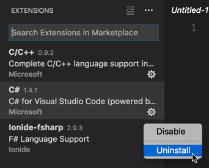
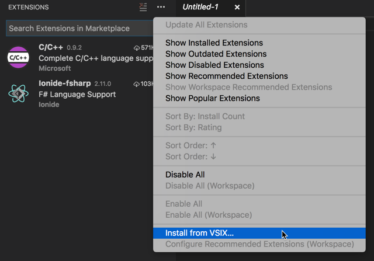

A new release of the C# extension is generally shipped every month or so. During development, interim beta releases are made available as VSIXs here: https://github.com/OmniSharp/omnisharp-vscode/releases. If you wish to install a beta release, please follow these steps:

#### Uninstalling a previously-installed C# extension

When installing a beta release, it's a good idea to remove any previous versions of the extension. You can do this like so:

1. Open Visual Studio Code and select View->Extensions from the menu to display the Extensions pane.
2. In the Extensions pane, locate the C# extension and click the little 'gear' icon next to it. From the drop-down menu, select 'Uninstall'.

   

3. Visual Studio Code will ask if you are sure that you want to uninstall the extension. Click "OK" on this prompt.
4. In the Extensions pane, a button will appear next to the C# extension that reads, "Reload". Click this to cause Visual Studio Code to reload without the C# extension installed. Visual Studio Code will ask you whether you are certain whether you wish to reload. Click "OK" to confirm.

#### Installing a beta release of the C# extension

First, find the release that you wish to install at https://github.com/OmniSharp/omnisharp-vscode/releases. Then, download the `.vsix` file for that release to your machine. Use the following steps to install the `.vsix` into Visual Studio Code.

1. Open Visual Studio Code and select View->Extensions from the menu to display the Extensions pane.
2. Click the `...` at the top-right corner of the Extensions pane and select "Install from VSIX..." on the menu that appears.

   

3. Locate the `.vsix` file you download and click "Open".
4. Visual Studio Code will prompt you to restart to enable the extension. Click "Restart" to confirm.

That's it!